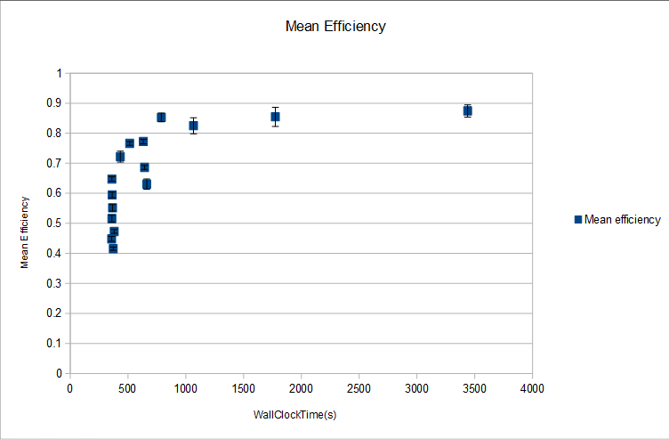
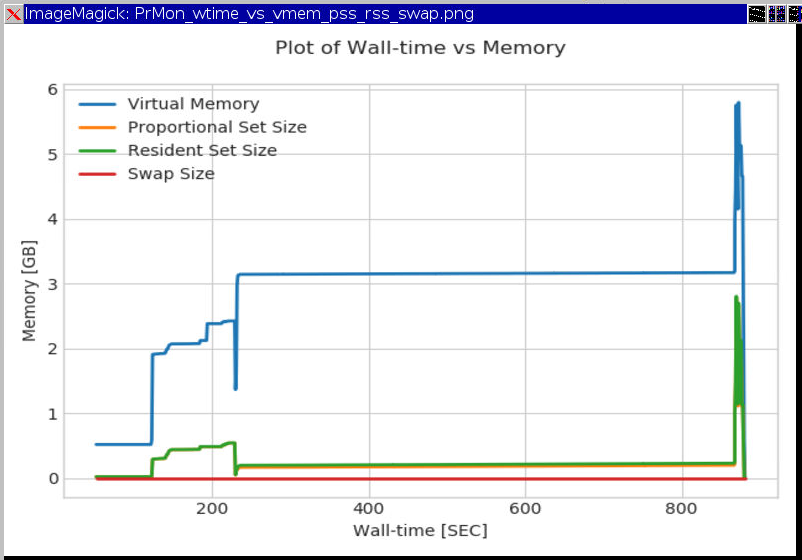

====================================
Benchmarking processing performance
====================================

Benchmarking and environment details:
======================================

-  where do we run the job

-  how much memory and how much processing the RASCIL imaging script is
   using

-  highly parallel so we may be able to use many processor nodes - how
   much memory do we need?

-  profiling doing: benchmarks in the memory and efficiency use of nodes

Rules IRIS imaging script
-------------------------

-  we have the component to run it: eg. RASCIL container on CVMFS (or under FC)

-  the user provides script and data

-  we provide:

   -  the .jdl model

   -  the singularity container on CVMFS, always latest release (or under FC) 

   -  environment has to be fully specified in container

   -  the container doesn’t need to be uploaded by the user

The .jdl model rules:
---------------------

-  the singularity container has to be on CVMFS, always latest release (or under FC) 

-  scripts should be only input sandbox (not on InputData)

-  large input/output datasets and data (including .tar .gz) should be
   on file catalogue only (LFN) - use InputData and OutputData
   parameters

-  OutputSandbox can contain standard output (StdOut), standard error
   (StdErr), small log files, job.info etc (only small files outputs)

The .jdl and .sh models samples
===============================

**Specific .jdl model with test data set for efficiency use of nodes:**

.. code:: python

   jobName = "%n_RASCILpipeline";

   Parameters=3;
   ParameterStart=1;
   ParameterStep=1;

   Executable = "trial.sh";

   StdOutput = "StdOut_%n";
   StdError = "StdErr_%n";

   Tags = {"8Processors","skatelescope.eu.hmem"}; # 2Processors, 4Processors,..,32Processors

   SitesList = "LCG.UKI-NORTHGRID-MAN-HEP.uk";
   SEList = "UKI-NORTHGRID-MAN-HEP-disk";

   InputSandbox = {"trial.sh","input_file1.json"};
   InputData = {"LFN:/skatelescope.eu/user/c/cimpan/rascil/
   emerlin_rascil_pipeline_for1252_1.tar",
   "LFN:/skatelescope.eu/user/w/willice.obonyo/IRIS_RASCIL_test/1252+5634.tar"};

   OutputSandbox = {"StdOut_%n","StdErr_%n","*.log"};
   OutputData = {"outputs.tar"};

   OutputSE = "UKI-NORTHGRID-MAN-HEP-disk";

**Specific .jdl model with test data set for memory benchmark:**

.. code:: python

   jobName = "RASCILpipeline";

   Executable = "trial.sh";

   StdOutput = "StdOut";
   StdError = "StdErr";

   Tags = {"8Processors","skatelescope.eu.hmem"};

   SitesList = "LCG.UKI-NORTHGRID-MAN-HEP.uk";
   SEList = "UKI-NORTHGRID-MAN-HEP-disk";

   InputSandbox = {"trial.sh","input_file1.json"};
   InputData = {"LFN:/skatelescope.eu/user/c/cimpan/rascil/
   prmon_2.0.2_x86_64-static-gnu93-opt.tar.gz",
   "LFN:/skatelescope.eu/user/c/cimpan/rascil/emerlin_rascil_pipeline_for1252_1.tar",
   "LFN:/skatelescope.eu/user/w/willice.obonyo/IRIS_RASCIL_test/1252+5634.tar"};

   OutputSandbox = {"StdOut","StdErr","job.info","*.log"};
   OutputData = {"outputs.tar","prmon.txt","prmon.json"};

   OutputSE = "UKI-NORTHGRID-MAN-HEP-disk";

**Specific .sh model used for both .jdl above:**

.. code:: python

   vi trial.sh
   #printenv;
   echo "==============================================";
   singularity --version;

   echo "Printing parameters"
   echo $0
   echo $1 #nprocs
   echo $2 #id_start
   echo $3 #id_end
   echo $4 #experiment
   echo "Processors: ${OMP_NUM_THREADS}";

   tar -xzvf 1252+5634.tar
   tar -xzvf emerlin_rascil_pipeline_for1252_1.tar

   echo "Extracting Process Monitor - This is to monitor the processes that we will run"

   mkdir -p prmon && tar xf prmon_2.0.2_x86_64-static-gnu93-opt.tar.gz -C prmon
   --strip-components 1

   echo "Running prmon"
   ./prmon/bin/prmon -p $$ -i 0 -u &

   time singularity exec --cleanenv -H $PWD:/srv --pwd /srv -C
   /cvmfs/sw.skatelescope.eu/images/rascil.img python3
   emerlin_rascil_pipeline/erp2_script.py --params input_file1.json

   tar czf outputs.tar *.fits

How .jdl model for efficiency use of nodes (modelcpu.jdl) works:
----------------------------------------------------------------

The .jdl can be used for 2Processors, 4Processors,..,32Processors
Parameters=3; means 3 jobs will be submitted (you can also choose
Parameters=10);

.. code:: python

   bash-4.2$ dirac-wms-job-submit modelcpu.jdl
   JobID = [26381707, 26381708, 26381709]
   Output data and logs
   bash-4.2$ dirac-wms-job-get-output 26381829
   bash-4.2$ dirac-wms-job-get-output-data 26381829
   Job 26381829 output data retrieved
   bash-4.2$ ls
   erp.log outputs.tar StdErr_2 StdOut_2
   bash-4.2$ tar -xzvf outputs.tar
   eMERLIN_testing_pipeline_1252+5634_cip_deconvolved_moment0.fits
   eMERLIN_testing_pipeline_1252+5634_cip_residual_moment0.fits
   eMERLIN_testing_pipeline_1252+5634_cip_restored_moment0.fits

We use the benchmarking `script <https://github.com/cimpan91/Docs/blob/main/Docs/benchm>`__

.. code:: python

   bash-4.2$ ./benchm 26381707 26381708 26381709

The output is stored in paramslog.csv, which can be opened on own workstation using Excel.

.. figure:: table.png
   :alt: Jobs parameters
   :name: fig:param

   Jobs parameters

Efficiency is calculated as TotalCPUTime(s)/(WallClockTime(s)*Number of
Processors) Mean and standard deviation can be calculated on efficiency
and then error bars can be plotted against mean WallClockTime(s). Below
is a plot for 10 jobs ran on processors 2 to 32.

   TotalCPUTime(s)/(WallClockTime(s)*Number of Processors)

How .jdl model for efficiency use of nodes (modelm.jdl) works:
--------------------------------------------------------------

The model uses `PRMON  <https://github.com/HSF/prmon/blob/main/README.md>`__ (PRocess MONitor) program. The output files are "prmon.txt","prmon.json" where "prmon.txt" can be plotted using “prmon_plot.py”. Example of plots are in figure below:

   TotalCPUTime(s)/(WallClockTime(s)*Number of Processors)
   

